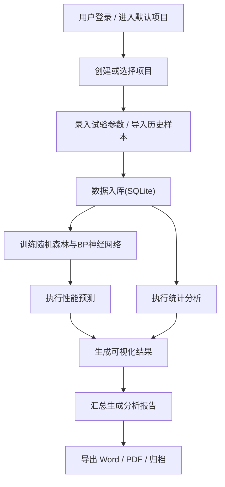
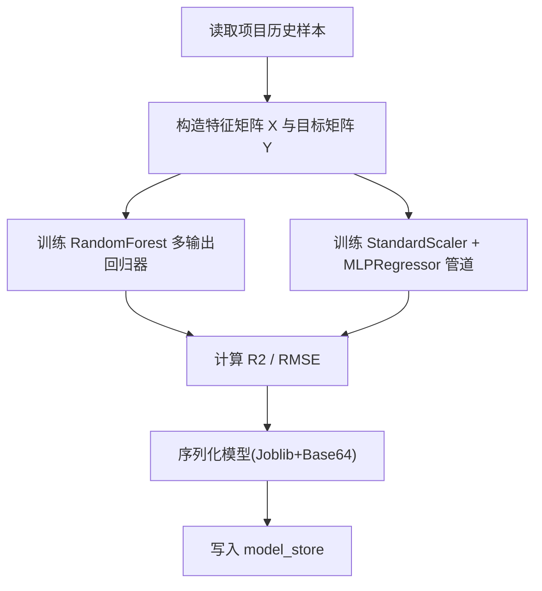
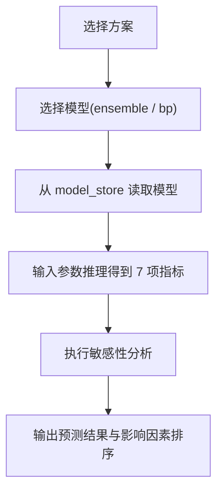
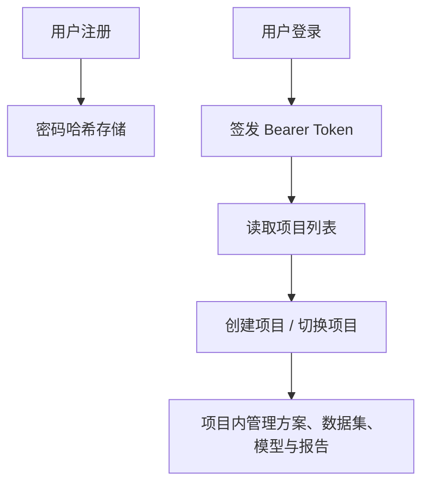

# MICP 系统流程图

## 1. 总体业务流程

```mermaid
flowchart TD
    A["用户登录 / 进入默认项目"] --> B["创建或选择项目"]
    B --> C["录入试验参数 / 导入历史样本"]
    C --> D["数据入库(SQLite)"]
    D --> E["训练随机森林与BP神经网络"]
    E --> F["执行性能预测"]
    D --> G["执行统计分析"]
    F --> H["生成可视化结果"]
    G --> H
    H --> I["汇总生成分析报告"]
    I --> J["导出 Word / PDF / 归档"]
```

## 2. 模型训练流程

```mermaid
flowchart TD
    A["读取项目历史样本"] --> B["构造特征矩阵 X 与目标矩阵 Y"]
    B --> C["训练 RandomForest 多输出回归器"]
    B --> D["训练 StandardScaler + MLPRegressor 管道"]
    C --> E["计算 R2 / RMSE"]
    D --> E
    E --> F["序列化模型(Joblib+Base64)"]
    F --> G["写入 model_store"]
```

## 3. 预测分析流程

```mermaid
flowchart TD
    A["选择方案"] --> B["选择模型(ensemble / bp)"]
    B --> C["从 model_store 读取模型"]
    C --> D["输入参数推理得到 7 项指标"]
    D --> E["执行敏感性分析"]
    E --> F["输出预测结果与影响因素排序"]
```

## 4. 用户与项目管理流程

```mermaid
flowchart TD
    A["用户注册"] --> B["密码哈希存储"]
    C["用户登录"] --> D["签发 Bearer Token"]
    D --> E["读取项目列表"]
    E --> F["创建项目 / 切换项目"]
    F --> G["项目内管理方案、数据集、模型与报告"]
```
