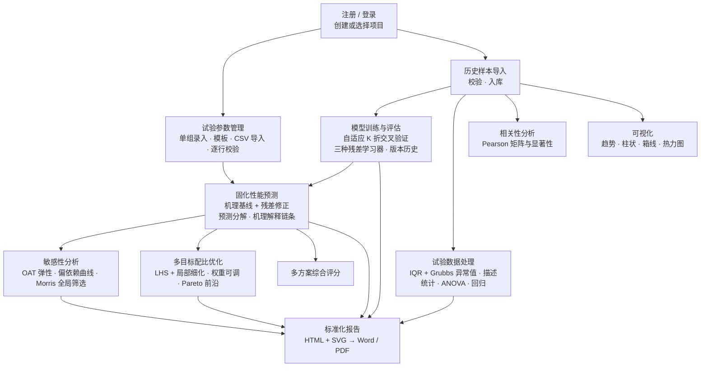
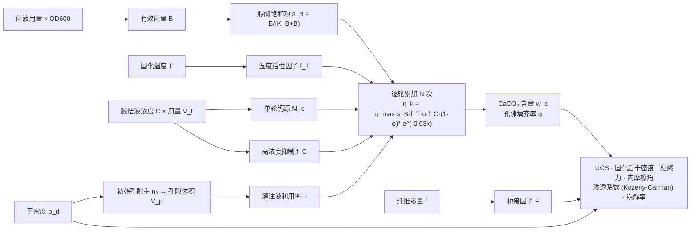
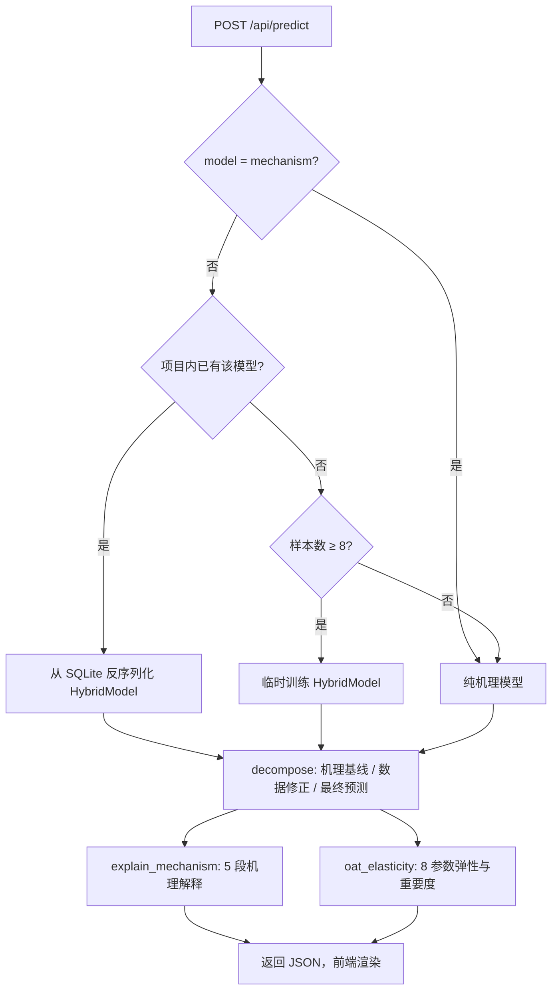
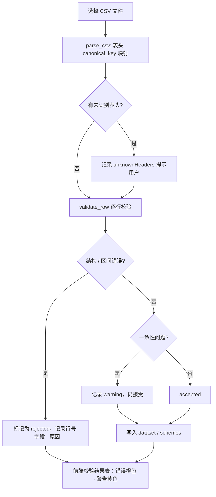
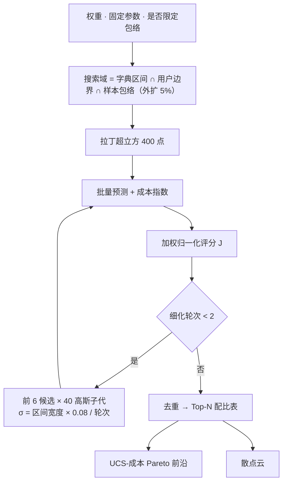
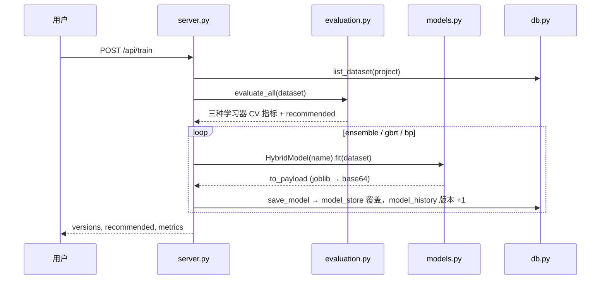

# 系统流程图

## 1. 总体业务流程

```mermaid
flowchart TD
    A[注册 / 登录<br/>创建或选择项目] --> B[试验参数管理<br/>单组录入 · 模板 · CSV 导入 · 逐行校验]
    A --> C[历史样本导入<br/>校验 · 入库]
    C --> D[模型训练与评估<br/>自适应 K 折交叉验证<br/>三种残差学习器 · 版本历史]
    B --> E[固化性能预测<br/>机理基线 + 残差修正<br/>预测分解 · 机理解释链条]
    D --> E
    E --> F[敏感性分析<br/>OAT 弹性 · 偏依赖曲线 · Morris 全局筛选]
    E --> G[多目标配比优化<br/>LHS + 局部细化 · 权重可调 · Pareto 前沿]
    E --> H[多方案综合评分]
    C --> I[试验数据处理<br/>IQR + Grubbs 异常值 · 描述统计 · ANOVA · 回归]
    C --> J[相关性分析<br/>Pearson 矩阵与显著性]
    C --> K[可视化<br/>趋势 · 柱状 · 箱线 · 热力图]
    E & F & D & I & G --> L[标准化报告<br/>HTML + SVG → Word / PDF]
```

## 2. 机理模型计算链

```mermaid
flowchart LR
    P1[菌液用量 × OD600] --> B[有效菌量 B]
    B --> SB["脲酶饱和项 s_B = B/(K_B+B)"]
    P2[固化温度 T] --> FT["温度活性因子 f_T"]
    P3[胶结液浓度 C × 用量 V_f] --> MC[单轮钙源 M_c]
    P3 --> FC["高浓度抑制 f_C"]
    P4[干密度 ρ_d] --> N0["初始孔隙率 n₀ → 孔隙体积 V_p"]
    N0 --> U["灌注液利用率 u"]
    SB & FT & FC & U & MC --> LOOP["逐轮累加 N 次<br/>η_k = η_max·s_B·f_T·u·f_C·(1-φ)³·e^(-0.03k)"]
    LOOP --> WC["CaCO₃ 含量 w_c<br/>孔隙填充率 φ"]
    P5[纤维掺量 f] --> F["桥接因子 F"]
    WC & F & P4 --> OUT["UCS · 固化后干密度 · 黏聚力 · 内摩擦角<br/>渗透系数 (Kozeny-Carman) · 崩解率"]
```

## 3. 预测与模型解析流程

```mermaid
flowchart TD
    A[POST /api/predict] --> B{model = mechanism?}
    B -- 是 --> M[纯机理模型]
    B -- 否 --> C{项目内已有该模型?}
    C -- 是 --> D[从 SQLite 反序列化 HybridModel]
    C -- 否 --> E{样本数 ≥ 8?}
    E -- 是 --> F[临时训练 HybridModel]
    E -- 否 --> M
    D & F & M --> G[decompose: 机理基线 / 数据修正 / 最终预测]
    G --> H[explain_mechanism: 5 段机理解释]
    G --> I[oat_elasticity: 8 参数弹性与重要度]
    H & I --> J[返回 JSON，前端渲染]
```

## 4. 数据导入校验流程

```mermaid
flowchart TD
    A[选择 CSV 文件] --> B[parse_csv: 表头 canonical_key 映射]
    B --> C{有未识别表头?}
    C -- 是 --> C1[记录 unknownHeaders 提示用户]
    C -- 否 --> D
    C1 --> D[validate_row 逐行校验]
    D --> E{结构 / 区间错误?}
    E -- 是 --> F[标记为 rejected，记录行号 · 字段 · 原因]
    E -- 否 --> G{一致性问题?}
    G -- 是 --> H[记录 warning，仍接受]
    G -- 否 --> I[accepted]
    H & I --> J[写入 dataset / schemes]
    F & J --> K[前端校验结果表：错误橙色 · 警告黄色]
```

## 5. 配比优化流程

```mermaid
flowchart TD
    A[权重 · 固定参数 · 是否限定包络] --> B["搜索域 = 字典区间 ∩ 用户边界 ∩ 样本包络（外扩 5%）"]
    B --> C[拉丁超立方 400 点]
    C --> D[批量预测 + 成本指数]
    D --> E[加权归一化评分 J]
    E --> F{细化轮次 < 2}
    F -- 是 --> G[前 6 候选 × 40 高斯子代<br/>σ = 区间宽度 × 0.08 / 轮次] --> D
    F -- 否 --> H[去重 → Top-N 配比表]
    H --> I[UCS-成本 Pareto 前沿]
    H --> J[散点云]
```

## 6. 模型训练与版本管理

```mermaid
sequenceDiagram
    participant U as 用户
    participant S as server.py
    participant E as evaluation.py
    participant M as models.py
    participant D as db.py
    U->>S: POST /api/train
    S->>D: list_dataset(project)
    S->>E: evaluate_all(dataset)
    E-->>S: 三种学习器 CV 指标 + recommended
    loop ensemble / gbrt / bp
        S->>M: HybridModel(name).fit(dataset)
        M-->>S: to_payload (joblib → base64)
        S->>D: save_model → model_store 覆盖，model_history 版本 +1
    end
    S-->>U: versions, recommended, metrics
```
